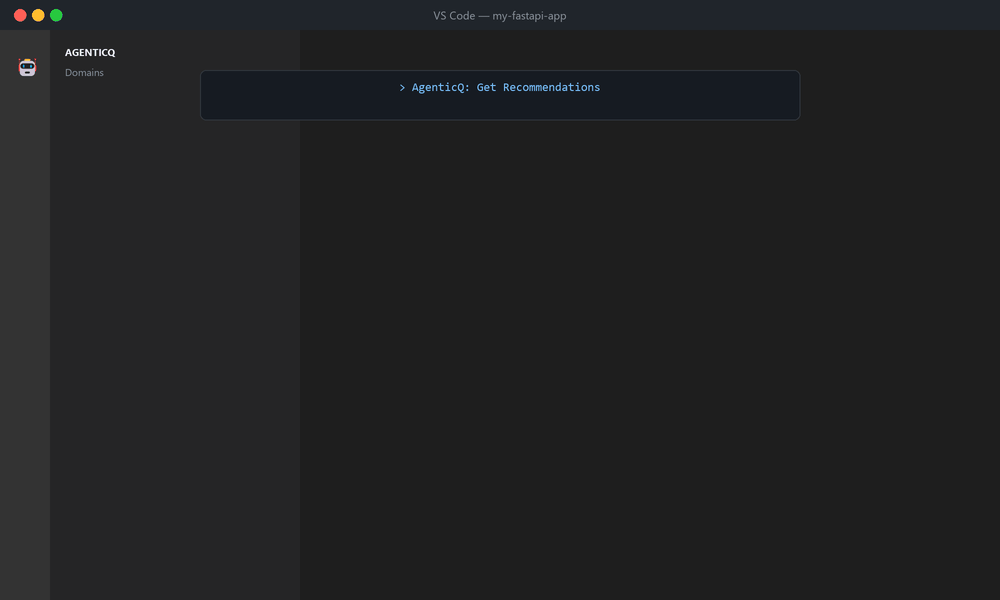
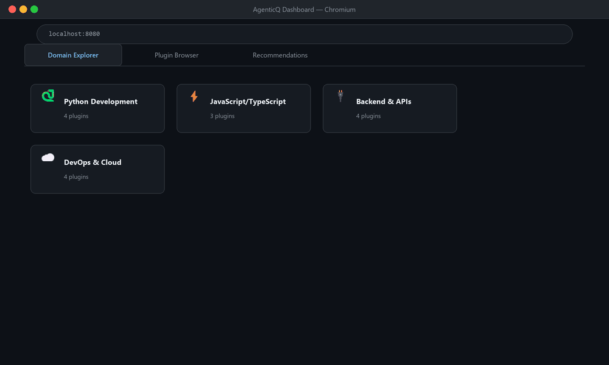
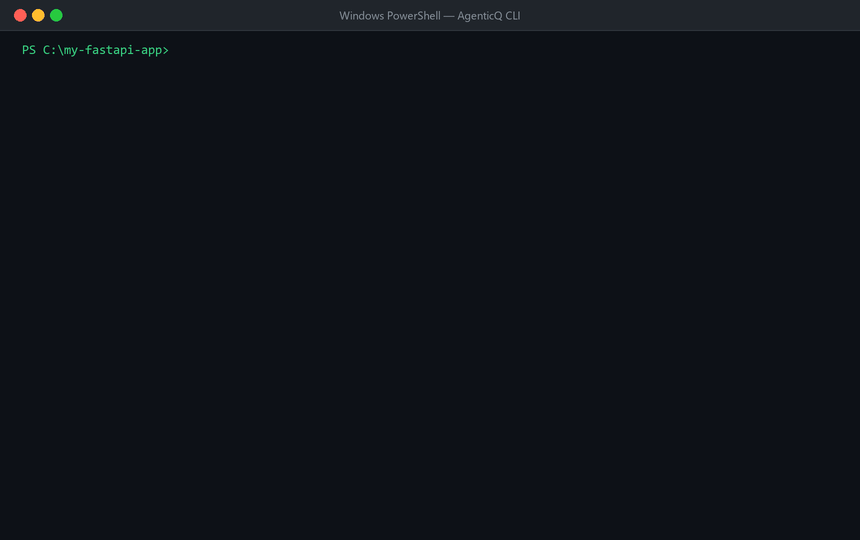

# AgenticQ — Intelligent Agent Scaffolding Engine

> Build smarter with curated agents from the [wshobson/agents](https://github.com/wshobson/agents) marketplace

## What is AgenticQ?

AgenticQ is a **CLI tool + Web GUI + VS Code extension** that helps you discover, recommend, and scaffold the right agents/skills/plugins for your project — minimizing token cost and maximizing AI output quality.

The [wshobson/agents](https://github.com/wshobson/agents) marketplace contains **81 plugins**, **191 agents**, **155 skills**, and **61 commands** across 12 domains. AgenticQ makes it easy to find and install exactly what you need.

## 🎬 Demo Videos

### VS Code Extension


### Web Interface


### CLI Usage


## Features

- 🔍 **Smart Recommendations**: Scans your project and recommends relevant plugins based on detected languages, frameworks, and infrastructure
- 📦 **Multi-Harness Support**: Scaffolds for Claude Code, Cursor, Gemini CLI, Codex, OpenCode, and GitHub Copilot
- 🎯 **Token Optimization**: Estimates token costs and suggests lean configurations
- 🤖 **Runtime Agent Builder**: Generates custom agents tailored to your specific project
- 🌐 **Three Interfaces**: CLI, standalone Web GUI, and VS Code extension
- 📊 **12 Domain Taxonomy**: Organized classification of plugins across Python, JavaScript, Backend, DevOps, Security, Data/ML, Documentation, Testing, Systems Programming, Business, Agent Orchestration, and Specialized domains

## Installation

### Prerequisites

- Python 3.10+
- Node.js 18+ (for VS Code extension)
- Git

### Install from source

```bash
git clone <this-repo>
cd AgenticQ
pip install -e .
```

### First-time setup

Clone the upstream marketplace and generate the catalog:

```bash
# Clone the upstream repo (or set AGENTICQ_UPSTREAM env var)
git clone https://github.com/wshobson/agents.git ~/.agenticq/upstream

# Generate catalog
agenticq update
```

## Quick Start

### CLI Usage

```bash
# Get recommendations for your project
agenticq recommend

# Browse all domains
agenticq browse

# Search for specific plugins
agenticq search fastapi

# Get detailed info about a plugin
agenticq info python-development

# Scaffold plugins into your project
agenticq scaffold python-development unit-testing --harness claude-code

# Build a custom runtime agent
agenticq build python-development backend-development --output my-agent.json

# Update catalog from upstream
agenticq update

# Launch web GUI
agenticq gui

# Show version
agenticq version
```

### Example: Python FastAPI Project

```bash
cd my-fastapi-project/

# Get recommendations
agenticq recommend

# Output:
# Detected:
#   Languages: python
#   Frameworks: fastapi
#   Infrastructure: docker
#   Databases: postgresql
#   Testing: pytest
#
# Recommended Plugins:
# ┌─────────────────────────┬───────┬────────┬──────────────────────────┐
# │ Plugin                  │ Score │ Tokens │ Reason                   │
# ├─────────────────────────┼───────┼────────┼──────────────────────────┤
# │ python-development      │  90.0 │ 30,218 │ matches Python project   │
# │ backend-development     │  85.0 │ 26,426 │ supports fastapi         │
# │ unit-testing            │  70.0 │  2,862 │ supports testing workflow│
# └─────────────────────────┴───────┴────────┴──────────────────────────┘

# Scaffold the top recommendations
agenticq scaffold python-development backend-development unit-testing
```

### Web GUI

```bash
# Launch standalone web dashboard
agenticq gui

# Opens at http://localhost:8080
```

### VS Code Extension

1. Open `vscode-extension/` in VS Code
2. Run `npm install`
3. Press F5 to launch Extension Development Host
4. Use Command Palette: `AgenticQ: Get Recommendations`

Or install from `.vsix`:
```bash
cd vscode-extension
npm install
npm run compile
# Package with vsce (install with: npm install -g @vscode/vsce)
vsce package
code --install-extension agenticq-0.1.0.vsix
```

## Domain Coverage

AgenticQ organizes 81 plugins into 12 domains, providing **191 agents**, **155 skills**, and **61 commands**:

| Domain | Icon | Plugins | Agents | Skills | Commands |
|--------|------|---------|--------|--------|----------|
| **Python Development** | 🐍 | 4 | 9 | 16 | 3 |
| **JavaScript/TypeScript** | ⚡ | 3 | 7 | 17 | 4 |
| **Backend & APIs** | 🔌 | 4 | 15 | 10 | 1 |
| **DevOps & Cloud** | ☁️ | 4 | 15 | 16 | 0 |
| **Security** | 🔒 | 4 | 8 | 5 | 2 |
| **Data & ML** | 🤖 | 4 | 9 | 16 | 4 |
| **Documentation** | 📚 | 4 | 12 | 4 | 1 |
| **Testing & QA** | ✅ | 4 | 7 | 0 | 3 |
| **Systems Programming** | ⚙️ | 3 | 7 | 6 | 0 |
| **Business & Marketing** | 📈 | 5 | 10 | 7 | 3 |
| **Agent Orchestration** | 🎭 | 4 | 7 | 9 | 13 |
| **Specialized** | 🎯 | 5 | 9 | 16 | 0 |

### Domain Descriptions

- **Python Development**: Modern Python with FastAPI, Django, async patterns
- **JavaScript/TypeScript**: React, Node.js, and web frameworks
- **Backend & APIs**: API design, GraphQL, REST, microservices
- **DevOps & Cloud**: Kubernetes, CI/CD, cloud infrastructure
- **Security**: Security scanning, compliance, secure coding
- **Data & ML**: Data engineering, MLOps, LLM applications
- **Documentation**: Technical docs, API docs, architecture diagrams
- **Testing & QA**: Unit testing, TDD, performance testing
- **Systems Programming**: Rust, Go, C/C++, embedded systems
- **Business & Marketing**: Analytics, SEO, content marketing
- **Agent Orchestration**: Multi-agent systems, context management
- **Specialized**: Blockchain, game dev, trading, payments

## CLI Reference

### Commands

| Command | Description | Options |
|---------|-------------|---------|
| `agenticq recommend` | Analyze project and recommend plugins | `--path` (project path)<br>`--domain` (filter by domain)<br>`--max-results` (limit) |
| `agenticq browse` | Browse all domains and plugins | None |
| `agenticq search <query>` | Search plugins, agents, and skills | Query string |
| `agenticq info <plugin>` | Show detailed plugin information | Plugin name |
| `agenticq scaffold <plugins...>` | Scaffold plugins into project | `--harness` (target harness)<br>`--target` (output directory) |
| `agenticq build <plugins...>` | Build custom runtime agent | `--path` (project path)<br>`--output` (output file) |
| `agenticq update` | Update catalog from upstream | None |
| `agenticq gui` | Launch web dashboard | `--host` (bind address)<br>`--port` (port number) |
| `agenticq serve` | Run backend server | `--jsonrpc` (JSON-RPC mode for VS Code) |
| `agenticq version` | Show version information | None |

### Environment Variables

| Variable | Description | Default |
|----------|-------------|---------|
| `AGENTICQ_UPSTREAM` | Path to wshobson/agents repository | `~/.agenticq/upstream` |

### Supported Harnesses

- **claude-code**: `.claude/plugins/` with agents/skills/commands
- **cursor**: `.cursor-plugin/plugins/*.json` + `.cursor/rules/*.mdc`
- **gemini**: `.gemini/` + `GEMINI.md`
- **codex**: `.codex/agents/` + `.codex/skills/`
- **opencode**: Similar to Claude Code
- **copilot**: `.github/copilot/instructions.md`

## Architecture

```
agenticq/
├── src/agenticq/
│   ├── cli.py                    # Typer CLI entrypoint
│   ├── config.py                 # Configuration helpers
│   ├── __main__.py               # python -m agenticq support
│   ├── core/
│   │   ├── catalog.py            # Marketplace indexer
│   │   ├── scanner.py            # Project tech-stack detector
│   │   ├── classifier.py         # Domain classification engine
│   │   ├── recommender.py        # Plugin recommendation engine
│   │   ├── scaffolder.py         # Multi-harness scaffolder
│   │   └── runtime_builder.py    # Dynamic agent generator
│   ├── models/
│   │   ├── plugin.py             # Plugin/Agent/Skill models
│   │   ├── project.py            # ProjectProfile model
│   │   └── taxonomy.py           # Domain taxonomy models
│   ├── data/
│   │   ├── catalog.json          # Indexed marketplace catalog
│   │   └── taxonomy.json         # 12-domain taxonomy
│   └── server/
│       ├── web.py                # Web GUI server (aiohttp)
│       └── jsonrpc.py            # JSON-RPC server for VS Code
├── gui/                          # Standalone Web GUI
│   ├── index.html
│   ├── app.js
│   └── styles.css
├── vscode-extension/             # VS Code Extension
│   ├── src/
│   │   ├── extension.ts
│   │   ├── pythonBridge.ts
│   │   ├── domainTreeProvider.ts
│   │   └── pluginsTreeProvider.ts
│   └── package.json
├── demos/                        # Demo GIF generators
│   ├── render/                   # PIL-based rendering engine
│   ├── demo1_vscode.py
│   ├── demo2_web.py
│   └── demo3_cli.py
└── tests/                        # pytest test suite
```

## How It Works

1. **Scanner** detects your project's tech stack by analyzing:
   - Language files (`pyproject.toml`, `package.json`, `Cargo.toml`, etc.)
   - Framework configs (`next.config.js`, Django settings, etc.)
   - Infrastructure (`Dockerfile`, `k8s/`, `.github/workflows/`)
   - Databases (migration dirs, ORM configs)
   - Testing tools (`pytest.ini`, `jest.config.js`)

2. **Classifier** maps detected stack to domains using file detection heuristics

3. **Recommender** scores plugins by:
   - Domain relevance (from classifier)
   - Token cost (prefers lower)
   - Dependency chains (plugins that pair well)
   - Conflict detection (overlapping agent roles)

4. **Scaffolder** generates harness-specific output for your chosen AI coding assistant

5. **Runtime Builder** creates custom agent configurations combining multiple plugins

## Testing

```bash
# Run all tests
pytest tests/ -v

# Run specific test suites
pytest tests/test_scanner.py -v
pytest tests/test_classifier.py -v

# Run comprehensive test script
python test_all.py
```

## Development

```bash
# Install dev dependencies
pip install -e ".[dev]"

# Format code
black src/ tests/

# Lint
ruff check src/ tests/

# Type check
mypy src/
```

## Credits

AgenticQ indexes and scaffolds plugins from the **[wshobson/agents](https://github.com/wshobson/agents)** marketplace created by:

- **Seth Hobson** ([@wshobson](https://github.com/wshobson)) — Primary author and maintainer
- **Community Contributors** — Plugin authors and contributors

All plugin content is licensed under their respective licenses (MIT, Apache-2.0). AgenticQ is a discovery and scaffolding tool that makes the marketplace more accessible.

### Upstream Repository

- **Repository**: https://github.com/wshobson/agents
- **Version**: 1.7.1
- **Plugins**: 81
- **Agents**: 191
- **Skills**: 155
- **Commands**: 61

## License

MIT License

Copyright (c) 2025 AgenticQ

Permission is hereby granted, free of charge, to any person obtaining a copy of this software and associated documentation files (the "Software"), to deal in the Software without restriction, including without limitation the rights to use, copy, modify, merge, publish, distribute, sublicense, and/or sell copies of the Software, and to permit persons to whom the Software is furnished to do so, subject to the following conditions:

The above copyright notice and this permission notice shall be included in all copies or substantial portions of the Software.

THE SOFTWARE IS PROVIDED "AS IS", WITHOUT WARRANTY OF ANY KIND, EXPRESS OR IMPLIED, INCLUDING BUT NOT LIMITED TO THE WARRANTIES OF MERCHANTABILITY, FITNESS FOR A PARTICULAR PURPOSE AND NONINFRINGEMENT. IN NO EVENT SHALL THE AUTHORS OR COPYRIGHT HOLDERS BE LIABLE FOR ANY CLAIM, DAMAGES OR OTHER LIABILITY, WHETHER IN AN ACTION OF CONTRACT, TORT OR OTHERWISE, ARISING FROM, OUT OF OR IN CONNECTION WITH THE SOFTWARE OR THE USE OR OTHER DEALINGS IN THE SOFTWARE.

## Contributing

Contributions are welcome! Please:

1. Fork the repository
2. Create a feature branch
3. Make your changes
4. Add tests
5. Submit a pull request

## Roadmap

- [ ] LLM-powered recommendations (optional, with API key)
- [ ] Plugin conflict resolution UI
- [ ] Custom taxonomy support
- [ ] Plugin usage analytics
- [ ] Integration with more harnesses
- [ ] Web GUI deployment (Docker image)
- [x] VS Code Marketplace publication
- [x] Comprehensive demo videos

## Support

- **Issues**: [GitHub Issues](https://github.com/sandeshbagmare/AgenticQ/issues)
- **Discussions**: [GitHub Discussions](https://github.com/sandeshbagmare/AgenticQ/discussions)
- **Upstream Marketplace**: [wshobson/agents](https://github.com/wshobson/agents)
